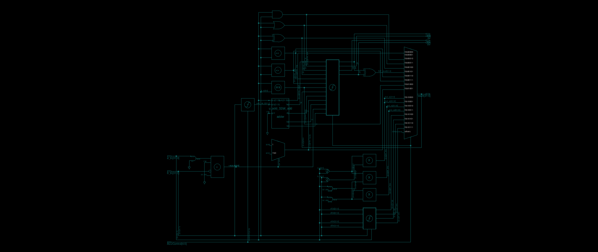
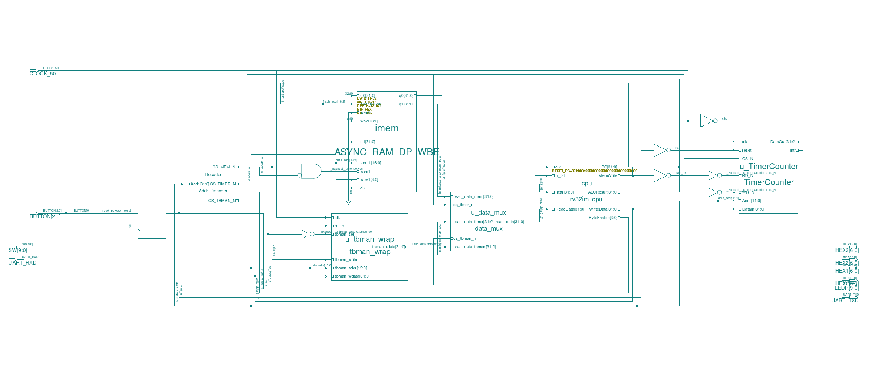
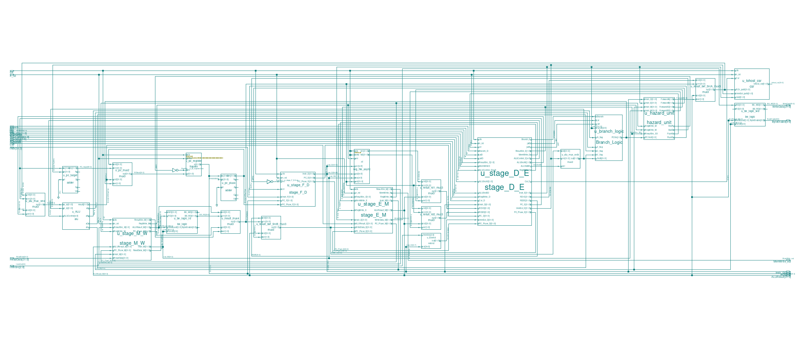
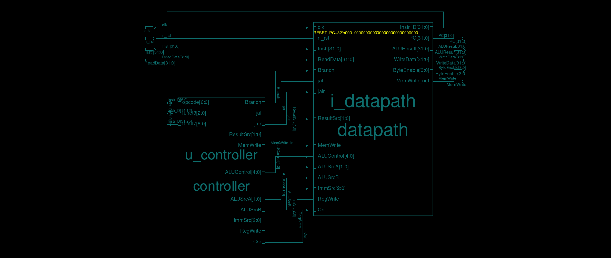
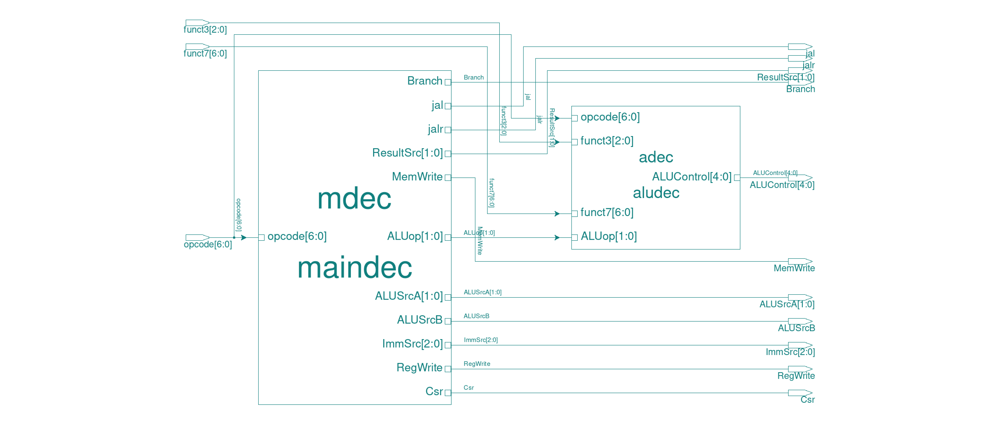
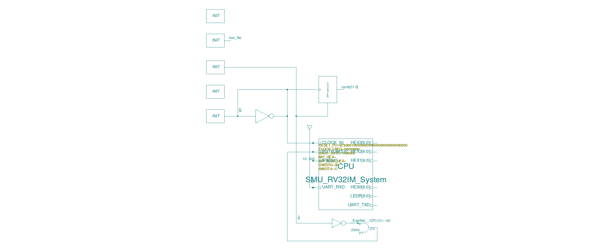

# ✖️ RISC-V RV32IM 5-Stage Pipelined CPU

[RV32I 5단 파이프라인](https://github.com/junyeong7138/RISC-V-RV32I-Pipeline-Design)에
**M 표준 확장(정수 곱셈/나눗셈)** 을 얹은 RV32IM CPU입니다.
ALU와 디코더를 확장하고, M 확장 명령이 포함된 ISA 테스트 스위트로 Synopsys VCS에서 검증했습니다.

| 항목 | 내용 |
|---|---|
| 추가 명령어 | `MUL` `MULH` `MULHSU` `MULHU` `DIV` `DIVU` `REM` `REMU` (R-type, `funct7=0000001`) |
| 확장 지점 | `aludec`(M 명령 디코드) + ALU 내부 곱셈/나눗셈 데이터패스 |
| 기반 | RV32I 5단 파이프라인 (포워딩·스톨·플러시, CSR, APB TBMAN/Timer 그대로 유지) |
| 검증 | M 확장 포함 ISA 테스트 + C 테스트 + 주변장치 테스트 (Dhrystone 포함) |

시리즈: [1️⃣ Single-Cycle](https://github.com/junyeong7138/RISC-V-RV32I-Single-Cycle-Design) →
[2️⃣ RV32I Pipeline](https://github.com/junyeong7138/RISC-V-RV32I-Pipeline-Design) →
**3️⃣ RV32IM Pipeline (현재)**

## 📂 Contents

1. [👨‍💻 Who Made?](#-who-made)
2. [🌳 개발환경](#-개발환경)
3. [🧮 HW Architecture](#-hw-architecture)
4. [✅ Verification](#-verification)
5. [📁 Repository Guide](#-repository-guide)

## 👨‍💻 Who Made?

박준영 (JuNyeong Park) — 상명대학교 3학년, CPU 설계 (2025-2)

[@junyeong7138](https://github.com/junyeong7138)

## 🌳 개발환경

| 설계 언어 | Simulation | Waveform | SW 툴체인 | 참고 교재 |
|---|---|---|---|---|
| SystemVerilog / Verilog | Synopsys VCS | Verdi (FSDB) | riscv64-unknown-elf-gcc | Harris & Harris, *DDCA RISC-V Edition* |

## 🧮 HW Architecture

### ✖️ M 확장의 핵심 — ALU 내부

곱셈 유닛(부호 조합별 MUL/MULH 계열)과 결과 선택 MUX가 추가된 ALU 내부 구조:



### 전체 구조

**System top** — CPU 코어(`rv32im_cpu`) + 듀얼포트 메모리 + 주소 디코더 + APB 주변장치:



**Pipelined datapath** — 파이프라인 레지스터(F/D·D/E·E/M·M/W), 해저드 유닛, 분기 판정, tohost CSR:



<details>
<summary>나머지 다이어그램 (CPU 코어 · 디코더 · 테스트벤치)</summary>





</details>

## ✅ Verification

| 폴더 | 내용 |
|---|---|
| `hardware/12.RV32IM_isa_tests` | ISA 테스트 스위트 — **M 확장 테스트(`mul`·`div`·`rem` 계열) 포함** |
| `hardware/22.RV32IM_c_tests` | C 테스트 (RISC-V GNU 툴체인 빌드) |
| `hardware/32.RV32IM_tbman_tests` | TBMAN 주변장치 테스트 (printf) |
| `hardware/34.RV32IM_timer_tests` | Timer 테스트 + Dhrystone |

패스/페일은 **`tohost` CSR(0x51e)** 로 보고되며, 테스트벤치가 `mem_path.vh`의
계층 경로로 감시합니다 (`tohost == 1`이면 pass).

### 실행 방법 (Synopsys VCS + Verdi + riscv64-unknown-elf 필요)

```sh
cd software/riscv-isa-tests && make          # 테스트 프로그램 빌드

cd hardware/12.RV32IM_isa_tests/sim/func_sim
make run test=all                            # M 확장 포함 전체 ISA 스위트
make verdi                                   # FSDB 파형 열기
```

## 📁 Repository Guide

```
├── hardware/
│   ├── source/pipeline_async/rev_RV32IM/   # ★ RV32IM RTL (M 확장 ALU·디코더)
│   ├── 12.RV32IM_isa_tests/                # ISA 테스트 환경 (mul/div 포함)
│   ├── 22.RV32IM_c_tests/
│   ├── 32.RV32IM_tbman_tests/
│   └── 34.RV32IM_timer_tests/
│       └── (각 환경) testbench/ + sim/func_sim/{Makefile, run.f, sim_define.v, mem_path.vh}
└── software/
    ├── riscv-isa-tests/                    # M 확장 포함 ISA 테스트 (.mif 포함)
    ├── c_tests/, tbman_tests/, timer_tests/
    └── 151_library/                        # 지원 라이브러리
```

## 🙏 Acknowledgements

- 과목 프레임워크는 UC Berkeley **EECS151/251A** FPGA 프로젝트를 일부 기반으로 합니다
- 참고 교재: Harris & Harris, *Digital Design and Computer Architecture: RISC-V Edition*
